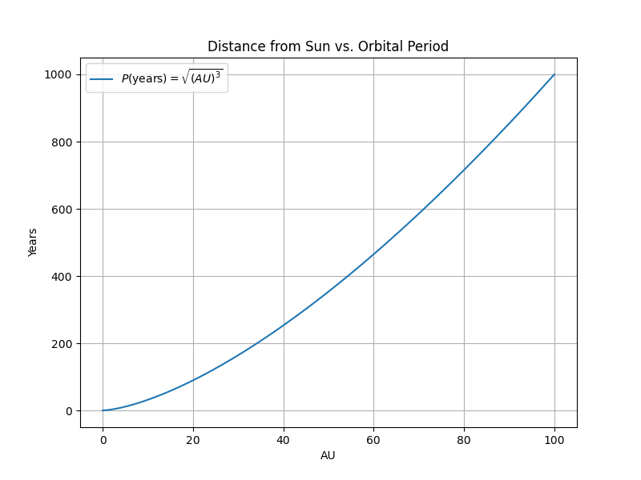
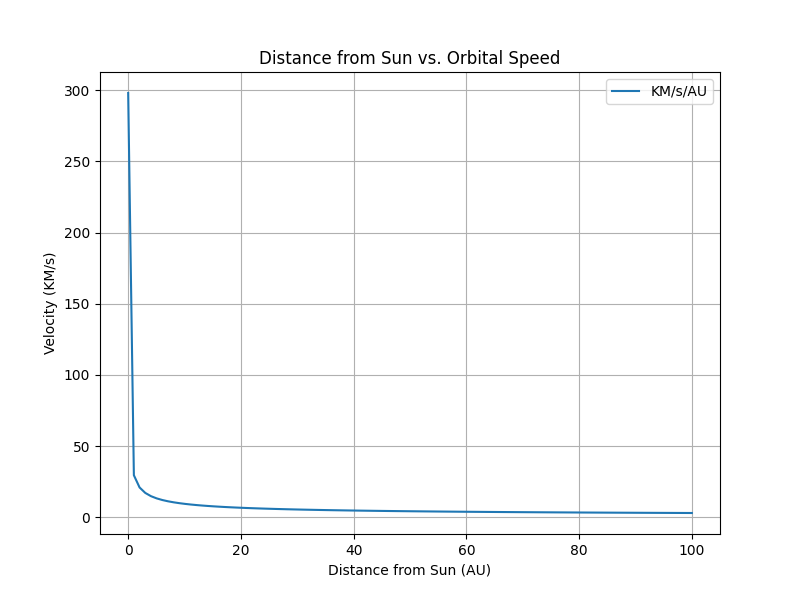

# Astronomy Python Tools

A collection of Python tools and visualizations related to astrophysics, orbital mechanics, relativity, and observational astronomy.

This repository contains Python scripts I've developed while studying astronomy. Many projects began as class concepts and later expanded into independent computational exploration, visualization, and debugging of astrophysical systems.

These include tools for:
- Spectral Line Calculations (Balmer Series)
- Orbital Mechanics (Kepler's Laws, Velocity, Linear Velocity, Rotational Period)
- Data Visualizations and Graphing
- Gravity Calculations (Gravitational Acceleration, Force)
- Albert Einstein's Mass-Energy Equivalence
- Relativity (Motion and Gravity Dilation)

## Tools

### Fundamentals
- Balmer Series Calculator (Visible Hydrogen Spectral Lines)
- Albert Einstein's Energy-Mass Equivalence Calculator

### Gravity Calculations
- Gravitational Acceleration Calculator
- Gravitational Acceleration Calculator (Stellar Masses)
- Gravitational Force Calculator

### Orbital Mechanics
- Kepler's Third Law Calculator (General)
- Kepler's Third Law Graph
- Distance from Sun vs. Orbital Velocity
- Linear Velocity from Rotational Period

### Relativity
- Gravitational Time Dilation Calculator
- Motion Time Dilation Calculator
- Gravitational Time Dilation + Motion Time Dilation Calculator

### Data Analysis (in progress)
- Light Curve Plotting Tools (for variable stars)

## Example Visualization

## Languages and Libraries Used
- Python
  - Astropy
  - Matplotlib
  - NumPy

## Development Notes
- Building these scripts has honestly made some homework take longer, but it has also helped me understand the math, physics, and visualizations.
- Many projects started as class concepts and eventually expanded into independent exploration and debugging.
 
